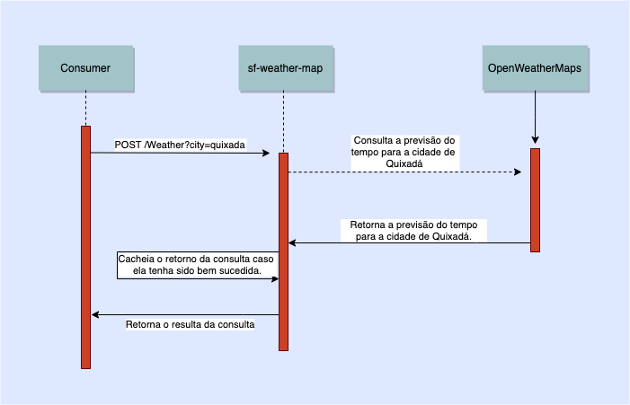

# OpenWeather Backend Basic Test

## Propósito

Este serviço é um test baseado no desafio proposto pelo ifood no 
[Link](https://github.com/ifood/ifood-backend-basic-test). O 
propósito inicial desse serviço é consultar a previsão do dia 
para uma cidade através da base do OpenWeather.

## Arquitetura

O projeto foi construído utilizando tecnologias Spring.

Não há jobs em background, a arquitetura do projeto é 
simples e reativa, utilizando Spring WebFlux, Spring 
Boot 2 e Kotlin.

Este serviço é um Gateway no sentido do termo utilizado pela
[Martin Fowler](https://martinfowler.com/eaaCatalog/gateway.html). 
Além desse tipo de serviço, existem outros papéis nessa biblioteca
que são realizados como: (i) Cache de chamadas para proteger da 
utilização excessiva e de abusos; (ii) Monitorar o status e métricas
da utilização desta API.

### Comunicações

Esse serviço apenas se comunica com a base de dados da OpenWeather.

Esse serviço não grava nada em nenhum banco, apesar de ter caches 
em memória local guardando as consultas por 1h.

Fluxo de comunicação esperado:



## Configurações

Este serviço precisa apenas da configuração de uma variável 
de ambiente com o token da api do OpenWeatherMaps.

Essa variável deve ser chamada de OPEN_WEATHER_MAP_KEY, como no exemplo abaixo.

```
OPEN_WEATHER_MAP_KEY=78ee6ea833e8ab4d843dd4bf7e471d3a
```

## Requisições e respostas

### Formato da consulta

Você pode consultar pelo nome da cidade ou nome da cidade, 
código do estado e código do país. Observe que a 
pesquisa por estados está disponível apenas para as 
localidades dos EUA.

1.
```
curl --location --request GET 'localhost:8080/Weather?city={cidade}'
```
2. 
```
curl --location --request GET 'localhost:8080/Weather?city={cidade},{cod do estado}'
```
3. 
```
curl --location --request GET 'localhost:8080/Weather?city={cidade},{cod do estado},{cod do país}'
```

#### Exemplos:

1.
```
curl --location --request GET 'localhost:8080/Weather?city=Fortaleza'
```
2.
```
curl --location --request GET 'localhost:8080/Weather?city=Fortaleza,Ce'
```
3.
```
curl --location --request GET 'localhost:8080/Weather?city=Fortaleza,Ce,BR'
```

## Testes

Os testes do serviço utilizam Spring Boot Tests para verificar o funcionamento do cache
e retorno das consultas.